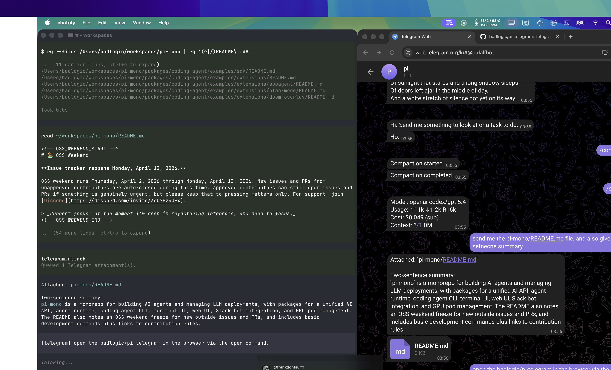

# pi-telegram-multiacc



Multi-account and multi-bot Telegram DM bridge for pi.

This independent extension is based on [badlogic/pi-telegram](https://github.com/badlogic/pi-telegram) and adds multiple Telegram account allowlisting plus separate bot configurations for separate pi sessions.

## Install

From git:

```bash
pi install git:github.com/musichen/pi-telegram-multiacc
```

Or for a single run:

```bash
pi -e git:github.com/musichen/pi-telegram-multiacc
```

## Configure

### Telegram

1. Open [@BotFather](https://t.me/BotFather)
2. Run `/newbot`
3. Pick a name and username
4. Copy the bot token

### pi

Start pi, then run:

```bash
/telegram-setup
```

Paste the bot token when prompted.

The extension stores config in:

```text
~/.pi/agent/telegram.json
```

### Add and select multiple bots

Run this command once for each additional bot:

```bash
/telegram-add
```

Paste the bot token when prompted. The extension calls Telegram's `getMe` API to
retrieve the bot username, then stores the configuration automatically as:

```text
~/.pi/agent/telegram-<bot-username>.json
```

Existing `telegram.json` configurations are renamed automatically on the next
start after the extension is updated, using their saved bot username.

Run `/telegram-connect` to select a bot for the current pi session. The menu
labels each choice with its bot username and configuration filename.

For scripts or a fixed session assignment, `PI_TELEGRAM_CONFIG` bypasses the menu:

```bash
PI_TELEGRAM_CONFIG="$HOME/.pi/agent/telegram-coding_bot.json" pi
```

Each configuration has its own bot token, allowlist, and update offset.

## Connect a pi session

The Telegram bridge is session-local. Connect it only in the pi session that should own the bot:

```bash
/telegram-connect
```

To stop polling in the current session:

```bash
/telegram-disconnect
```

Check status:

```bash
/telegram-status
```

## Pair Telegram accounts

After token setup and `/telegram-connect`:

1. Open the DM with your bot in Telegram
2. Send `/start` from the first account
3. Add additional numeric Telegram user IDs to `~/.pi/agent/telegram.json`:

```json
"allowedUserIds": [530236679, 123456789]
```

The extension accepts messages from every listed account. Existing configs using
`allowedUserId` are migrated automatically when the bridge reconnects.

## Usage

Chat with your bot in Telegram DMs.

### Send text

Send any message in the bot DM. It is forwarded into pi with a `[telegram]` prefix.

### Send images and files

Send images, albums, or files in the DM.

The extension:
- downloads them to `~/.pi/agent/tmp/telegram`
- includes local file paths in the prompt
- forwards inbound images as image inputs to pi

### Ask for files back

If you ask pi for a file or generated artifact, pi should call the `telegram_attach` tool. The extension then sends those files with the next Telegram reply.

Examples:
- `summarize this image`
- `read this README and summarize it`
- `write me a markdown file with the plan and send it back`
- `generate a shell script and attach it`

### Stop a run

In Telegram, send:

```text
stop
```

or:

```text
/stop
```

That aborts the active pi turn.

### Queue follow-ups

If you send more Telegram messages while pi is busy, they are queued and processed in order.

## Streaming

The extension streams assistant text previews back to Telegram while pi is generating.

It tries Telegram draft streaming first with `sendMessageDraft`. If that is not supported for your bot, it falls back to `sendMessage` plus `editMessageText`.

## Notes

- Only one pi session should be connected to the bot at a time
- Replies are sent as normal Telegram messages, not quote-replies
- Long replies are split below Telegram's 4096 character limit
- Outbound files are sent via `telegram_attach`

## License

MIT
